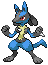

# Multimon 

## Description
Multimon is a dataset specifically made for Multitask Learning (MTL) based on the popular Pokémon videogame series. It contains sprites of every pokemon in the series and has labels for multiple tasks.

## Dataset Structure
Note that due to copyright restrictions, the dataset is not available for direct download. Other than the main script, the files described below are not present but are constructed by running the script main.py.

### [The Main Script](main.py)
This script contains everything you need to construct the dataset. It will download the sprites and labels from the [PokeAPI](https://pokeapi.co/), perform postprocessing (standardising the sprites and labels) and construct partitions for train/test and train/test/validation splits.

### [The Sprites](sprites/)
Sprites are stored in two directories, sprites/processed for the actual sprites to use and sprites/raw for raw images (these are provided in case you want to do custom postprocessing, though it's unlikely you'll ever need to)

### [The Data](data.csv)
This is the main file containing the labels. It contains the following columns:

| Name         | Description                                  | Type    | 
|--------------|----------------------------------------------|---------|
| `index`      | The filename of the sprite                   | string  |
| `type1`[^1]  | The first type of the pokemon                | int     |
| `type2`[^1]  | The second type of the pokemon               | int     |
| `gen`        | The generation the pokemon was introduced in | integer |
| `hp`[^2]     | The HP stat of the pokemon                   | float   |
| `atk`[^2]    | The attack stat of the pokemon               | float   |
| `def`[^2]    | The defense stat of the pokemon              | float   |
| `spatk`[^2]  | The special attack stat of the pokemon       | float   |
| `spdef`[^2]  | The special defense stat of the pokemon      | float   | 
| `spd`[^2]    | The speed stat of the pokemon                | float   |
| `height`[^2] | The height of the pokemon                    | float   |
| `weight`[^2] | The weight of the pokemon                    | float   |

[^1] Pokémon have one or two of 17 types, for consistency we create an 18th "null" type. `type1` and `type2` should be interpreted as a **two-hot vector together**.

[^2]: hp and all the columns below are provided as the raw value, as well as the normalised and standardised values (suffixed as "_raw", "_norm" and "_std" respectively)